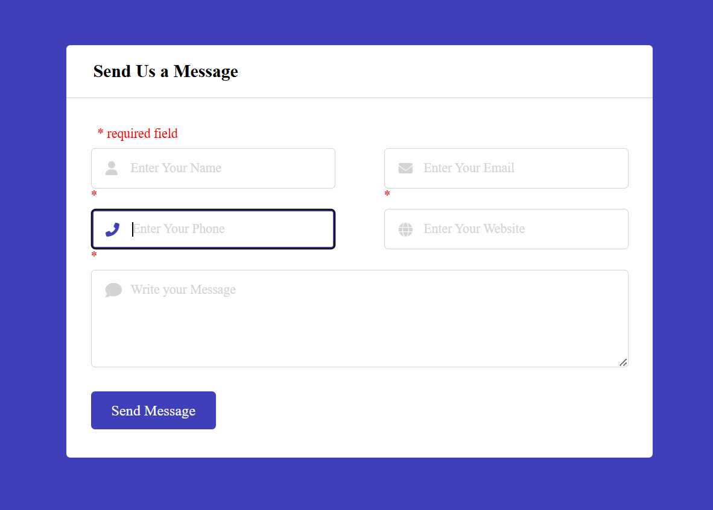

# Form Validation using HTML, CSS, and PHP

This project showcases a form validation example using HTML, CSS for styling, and PHP for server-side validation. The form includes input fields for user data, such as name, email, and other fields, with validation rules enforced to ensure data accuracy and security.

## Features

- Client-side form styling with HTML and CSS for an intuitive user experience.
- Server-side validation using PHP to check form submissions for correctness.
- Custom error messages displayed for invalid inputs.
- Input sanitization and validation to prevent security risks such as SQL injection and XSS.

## Technologies Used

- **HTML**: Markup structure for the form.
- **CSS**: Styling and responsive design.
- **PHP**: Server-side validation logic.

## Getting Started

### Prerequisites

- A web server with PHP support (e.g., XAMPP, WAMP, or a live web server).
- Basic knowledge of HTML, CSS, and PHP.

### Installation

 - Clone this repository:
   git clone https://github.com/Sana-Shah-een/FormValidThrough_PHP.git

